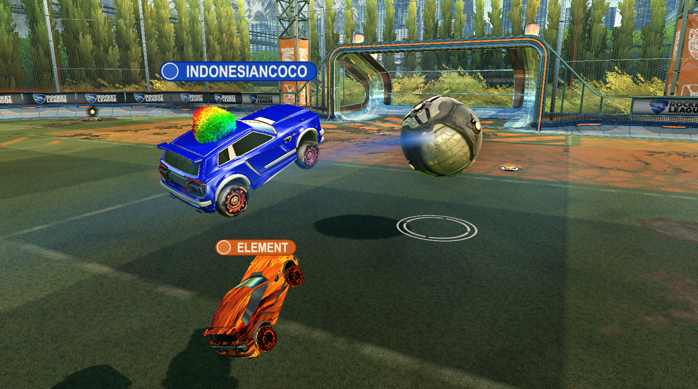
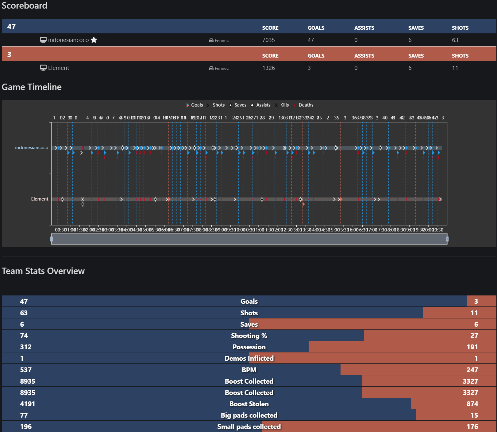

# Indonesian Coconut — A Reinforcement-Learning Rocket League Bot

Indonesian Coconut is a reinforcement-learning–driven Rocket League bot built using RLGym and a discrete lookup-table action space. Unlike continuous-control agents that rely on large action vectors and dense motor precision, Indonesian Coconut operates with a compact, interpretable discrete action representation while still achieving high-level mechanical behaviors such as controlled air-dribbles, flip resets, pressure-aware flicks, possession-safe dribbling, and adaptive defensive rotations.

The bot is trained using a specialized multi-component reward architecture designed to optimize not only for raw shot power or ball velocity, but for decision quality and possession stability. The reward system embeds concepts such as challenge anticipation, dribble retention, controlled aerial touches, boost-energy budgeting, and goal-probability shaping. This allows Indonesian Coconut to behave more like a human competitive player—with deliberate buildup, safe dispossession, and well-timed mechanical execution—rather than a purely greedy offense-maximizer.

## Performance Evaluation

To benchmark policy quality, Indonesian Coconut was evaluated against Element, an established S-tier bot in the RLBot competitive scene. Using a binomial scoring model to assess statistical significance:

Each goal is treated as an independent Bernoulli trial.

Total trials: n = 69.

Under the null hypothesis of equal skill (p = 0.5), achieving ≥ 42–28 is required for p < 0.05.

Indonesian Coconut achieved a decisive result of: **47–3**

This exceeds the statistical significance threshold by a wide margin, providing strong evidence that Indonesian Coconut’s learned policy is overwhelmingly stronger across the full distribution of 1v1 play. See match statistics [here](https://ballchasing.com/replay/41b8d475-dc5a-4488-9144-a2c86c9a649b)

### Clips: (Embed may not work, see highlights folder.)
<video controls src="https://genewica.com/images/Flick_over.mp4" title="Flick_over"></video>
<video controls src="https://genewica.com/images/off_wall.mp4" title="Off_wall"></video>
<video controls src="https://genewica.com/images/speedflip_flick.mp4" title="Speedflip_flick"></video>

